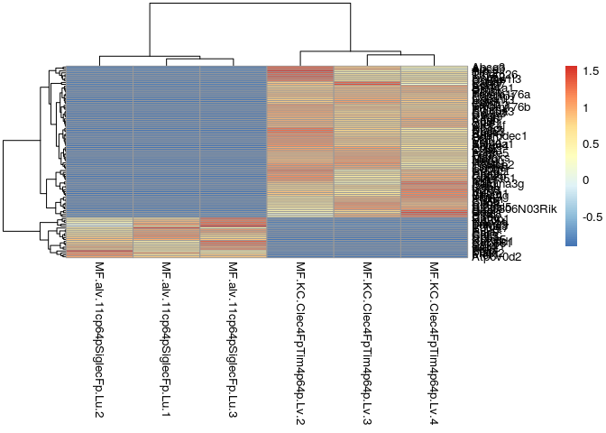
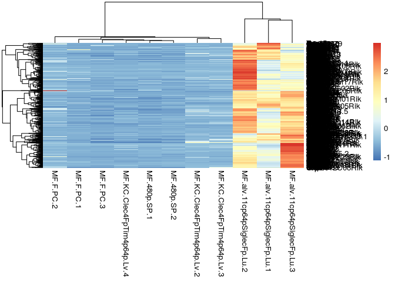

Immunology project for computation biologists
================

The goal of this project is to design a pooled CRISPR screen to study an
immunological process of your
choice.

## Introduction to pooled CRISPR screens combined with single-cell RNA sequencing

In a pooled CRISPR screen, cells are transfected by a library of vectors
that all target different genes in different ways. Each of these vectors
is barcoded so that we can later derive which cell was targeted by which
vector. A couple of hours after transfection, cells are profiled using
single-cell (RNA) sequencing techniques (Wagner, Regev, and Yosef 2016).
After some computational analyses, we derive for each cell it’s
expression profile and the vectors by which the cells were transfected.

Most often, a gene is knocked-out (loss-of-function), for example
Perturb-Seq (Dixit et al. 2016) or CROP-Seq (Datlinger et al. 2017)).
But genes can also be targeted in other ways, for example by
overexpression (gain-of-function) using CRISPRa (Wang et al. 2019). The
possibilities are basically endless; one might imagine that libraries
will be designed to target individual point mutations (Anzalone et al.
2019).

Most screens until now were performed *in vitro*, but exploring *in
vivo* screens is probably not far off. The main limiting factor here is
making sure that the correct cells are transfected; one solution for
immunology might be to do an adoptive transfer of bone marrow cells
which were transfected.

## The project

Doing a pooled screen can be very expensive. To get enough signal over
noise, you need to profile enough cells (hundreds) for each vector, so
checking the effect of 100 vectors requires you to profie hundreds of
thousands of cells, and with about $0.5-$1 per cell, …. you can do the
calculation\!

To lower the cost, we typically want to do a targeted screen, where we
narrow down to a subset of genes. This may be based on function
(e.g. transcription factors) and expression pattern (e.g. genes
specific to alveolar macrophages).

In this example, we’re going to design a screen for transcription
factors that may be important for alveolar macrophages. For the project,
you should design a screen for a different topic. Feel free to explore
and be creative\!

## Selecting potential genes based on function

``` r
library(org.Mm.eg.db)
```

<GO:0003700> is the Gene Ontology identifier for “DNA-binding
transcription factor activity”

You can explore the Gene Ontology at
<https://www.ebi.ac.uk/QuickGO/term/GO:0003700>

Our expression dataset uses gene symbols, so we have to convert the
entrez ids

``` r
tfs_entrezid <- as.list(org.Mm.egGO2ALLEGS)$`GO:0003700`
tfs <- unique(AnnotationDbi::select(org.Mm.eg.db, keys=tfs_entrezid, columns=c("SYMBOL"), keytype="ENTREZID")$SYMBOL)
```

    ## 'select()' returned many:1 mapping between keys and columns

``` r
length(tfs)
```

    ## [1] 1001

## Selecting potential genes based on expression

``` r
library(limma)
```

### Using ImmGen RNA-seq

The ImmGen consortium has generated bulk gene expression dataset of a
lot of immune cells. These datasets are generated using a standardized
protocol to limit the batch effects, and the exact FACS gating
strategies are (in most cases) provided so that the sorting can be
reproduced
(e.g. <http://rstats.immgen.org/Skyline/resources/Sorting_PDFs_OSMNP/Mo.6Chi11b+.APAP.36h.Lv.pdf>).

The most extensive dataset was generated using microarrays:

  - To browse the data: <http://www.immgen.org/databrowser/index.html>
  - Data can be downloaded at
    <https://www.ncbi.nlm.nih.gov/geo/query/acc.cgi?acc=GSE15907> and
    <https://www.ncbi.nlm.nih.gov/geo/query/acc.cgi?acc=GSE37448>

Nowadays, these is also an extensive RNA-seq dataset available:

  - Browsing: <http://rstats.immgen.org/Skyline/skyline.html>
  - ImmGen ULI RNASeq, containing an overview of all immune populations:
    <https://www.ncbi.nlm.nih.gov/geo/query/acc.cgi?acc=GSE127267>
  - ImmGen MNP OpenSource, a community-based dataset because of the
    extensive heterogeneity and the expertise required for correct
    sorting (“Open-Source ImmGen: Mononuclear Phagocytes” 2016):
    <https://www.ncbi.nlm.nih.gov/geo/query/acc.cgi?acc=GSE122108>

We download the MNP dataset here:

``` r
# geo <- getGEO("GSE122108")
if (!file.exists("data/GSE122108_Gene_count_table.csv.gz")) {
  curl::curl_download("https://www.ncbi.nlm.nih.gov/geo/download/?acc=GSE122108&format=file&file=GSE122108_Gene_count_table.csv.gz", "data/GSE122108_Gene_count_table.csv.gz")
}
```

``` r
# read in the counts matrix
counts_df <- read.table("data/GSE122108_Gene_count_table.csv.gz", header = TRUE, stringsAsFactors = FALSE)
counts <- as.matrix(counts_df[, 2:ncol(counts_df)])
rownames(counts) <- counts_df$gene_symbol
# colnames(counts) <- gsub('-', 'min', colnames(counts)) # R doesnt like - or + signs in names
# colnames(counts) <- gsub('\\+', 'plus', colnames(counts))

# remove genes that are very lowly expressed
counts <- counts[apply(counts, 1, max) >= 10, ]

# create a dataframe with information on each sample
sample_info <- data.frame(
  sample_id =  colnames(counts),
  population_id = gsub("(.*)\\.[0-9]*", "\\1", colnames(counts)),
  stringsAsFactors = FALSE
)
```

``` r
head(sample_info, 20)
```

    ##              sample_id     population_id
    ## 1  MF.64pLYVEpIIn.Ao.1 MF.64pLYVEpIIn.Ao
    ## 2  MF.64pLYVEpIIn.Ao.2 MF.64pLYVEpIIn.Ao
    ## 3  MF.64pLYVEpIIn.Ao.3 MF.64pLYVEpIIn.Ao
    ## 4  MF.64pLYVEpIIp.Ao.1 MF.64pLYVEpIIp.Ao
    ## 5  MF.64pLYVEpIIp.Ao.2 MF.64pLYVEpIIp.Ao
    ## 6  MF.64pLYVEpIIp.Ao.3 MF.64pLYVEpIIp.Ao
    ## 7  MF.64pLYVEnIIp.Ao.1 MF.64pLYVEnIIp.Ao
    ## 8  MF.64pLYVEnIIp.Ao.2 MF.64pLYVEnIIp.Ao
    ## 9  MF.64pLYVEnIIp.Ao.3 MF.64pLYVEnIIp.Ao
    ## 10            MF.PC.44             MF.PC
    ## 11            MF.PC.45             MF.PC
    ## 12            MF.PC.46             MF.PC
    ## 13           MF.F.PC.1           MF.F.PC
    ## 14           MF.F.PC.2           MF.F.PC
    ## 15           MF.F.PC.3           MF.F.PC
    ## 16            MF.PC.47             MF.PC
    ## 17            MF.PC.48             MF.PC
    ## 18            MF.PC.49             MF.PC
    ## 19            MF.PC.50             MF.PC
    ## 20            MF.PC.51             MF.PC

We can use limma-voom to find genes that are differentially expressed
between two populations. Let’s first explore how to get differentially
expressed genes between two populations of interest, for example Kupffer
cells and alveolar
macrophages:

``` r
population_ids_oi <- c("MF.alv.11cp64pSiglecFp.Lu","MF.KC.Clec4FpTim4p64p.Lv")
sample_info_oi <- sample_info %>% 
  filter(population_id %in% population_ids_oi)
counts_oi <- counts[, sample_info_oi$sample_id]

group <- sample_info_oi$population_id
mm <- model.matrix(~0 + group)
y <- voom(counts_oi, mm, plot = T)
```

<!-- -->

``` r
# construct a linear model with one term: the "group"

fit <- lmFit(y, mm)
contr <- makeContrasts(paste0("group", population_ids_oi[[1]], "-", "group", population_ids_oi[[2]]), levels = colnames(coef(fit)))
contr_fit <- contrasts.fit(fit, contr)
```

``` r
ebayes_fit <- eBayes(contr_fit)

top.table <- topTable(ebayes_fit, sort.by = "P", number = Inf)
```

``` r
genes_oi <- top.table %>% 
  rownames_to_column("gene_id") %>% 
  filter(adj.P.Val < 0.05, abs(logFC) > 1) %>% 
  top_n(100, abs(logFC)) %>% 
  pull(gene_id)
```

Plot the genes in a heatmap. We will scale the expression per gene.

``` r
expression_oi <- edgeR::cpm(counts_oi)[genes_oi, ]
expression_oi_scaled <- t(scale(t(expression_oi)))
pheatmap::pheatmap(expression_oi_scaled)
```

<!-- -->

``` r
get_marker_genes <- function(counts, sample_info, populations_reference, population_oi) {
  # select relevant sample_info and counts
  sample_info_oi <- sample_info %>% 
    filter(population_id %in% c(populations_reference, population_oi))
  counts_oi <- counts[, sample_info_oi$sample_id]
  counts_oi <- counts_oi[apply(counts_oi, 1, mean) >= 1, ]
  
  # build linear model
  group <- sample_info_oi$population_id
  mm <- model.matrix(~0 + group)
  y <- voom(counts_oi, mm)
  
  fit <- lmFit(y, mm)
  
  # get differential expression for each reference population
  differential_expression <- lapply(populations_reference, function(population_reference) {
    contr_formula <- paste0("group", population_oi, "-", "group", population_reference)
    contr <- makeContrasts(contrasts = contr_formula, levels = colnames(coef(fit)))
    contr_fit <- contrasts.fit(fit, contr)
    
    ebayes_fit <- eBayes(contr_fit)
    top.table <- topTable(ebayes_fit, sort.by = "P", number = Inf)
    top.table %>% 
      rownames_to_column("gene_id") %>% 
      mutate(
        population_1 = population_oi,
        population_2 = population_reference
      )
  }) %>% 
    bind_rows()
}
```

``` r
populations_reference <- c("MF.F.PC","MF.alv.11cp64pSiglecFp.Lu" , "MF.480p.SP")
population_oi <- "MF.KC.Clec4FpTim4p64p.Lv"
differential_expression <- get_marker_genes(counts, sample_info, populations_reference, population_oi)
```

``` r
markers <- differential_expression %>% 
  group_by(gene_id) %>% 
  summarise(max_adj_pval = max(adj.P.Val), min_logfc = min(logFC)) %>% 
  filter(max_adj_pval < 0.05, min_logfc > 2) %>% 
  pull(gene_id)

samples_oi <- sample_info %>% filter(population_id %in% c(population_oi, populations_reference)) %>% pull(sample_id)
expression_oi <- log2(counts/colSums(counts) + 1)[markers, samples_oi]
expression_oi_scaled <- t(scale(t(expression_oi)))
pheatmap::pheatmap(expression_oi_scaled)
```

<!-- -->

## Designing the CRISPR library

``` r
genes_oi <- intersect(markers, tfs)
cat(paste0(genes_oi, collapse = "\n"))
```

    ## Bcl6b
    ## Erg
    ## Gata4
    ## Hey1
    ## Hic1
    ## Hnf4a
    ## Id3
    ## Ifi205
    ## Ifi208
    ## Meis2
    ## Nfib
    ## Nfxl1
    ## Nr1h4
    ## Nr2f2
    ## Ppara
    ## Rorc
    ## Smad6
    ## Sox18
    ## Tead4

Submit this to
<https://portals.broadinstitute.org/gpp/public/analysis-tools/sgrna-design>
(or any related tool)

``` r
sgrna_design <- read_tsv("results/sgrna_designs.txt")
```

    ## Parsed with column specification:
    ## cols(
    ##   .default = col_character(),
    ##   Quota = col_double(),
    ##   `Target Taxon` = col_double(),
    ##   `Target Gene ID` = col_double(),
    ##   `Target Alias` = col_logical(),
    ##   `Initial Spacing Requirement` = col_double(),
    ##   `Off-Target Match Ruleset Version` = col_double(),
    ##   `Off-Target Tier Policy` = col_double(),
    ##   `sgRNA Cut Position (1-based)` = col_double(),
    ##   `Exon Number` = col_double(),
    ##   `Target Cut Length` = col_double(),
    ##   `Target Total Length` = col_double(),
    ##   `Target Cut %` = col_double(),
    ##   `On-Target Efficacy Score` = col_double(),
    ##   `On-Target Rank` = col_double(),
    ##   `Off-Target Rank` = col_double(),
    ##   `On-Target Rank Weight` = col_double(),
    ##   `Off-Target Rank Weight` = col_double(),
    ##   `Combined Rank` = col_double(),
    ##   `Pick Order` = col_double(),
    ##   `Picking Round` = col_double()
    ## )

    ## See spec(...) for full column specifications.

Let’s choose for each target gene one guide RNA:

``` r
sgrna_design %>% 
  group_by(Input) %>% 
  top_n(1, `Combined Rank`) %>% 
  dplyr::select(`Target Gene Symbol`, `sgRNA Sequence`)
```

    ## Adding missing grouping variables: `Input`

    ## # A tibble: 19 x 3
    ## # Groups:   Input [19]
    ##    Input  `Target Gene Symbol` `sgRNA Sequence`    
    ##    <chr>  <chr>                <chr>               
    ##  1 Bcl6b  Bcl6b                GCCTTGGGGTCTGGGCTGGC
    ##  2 Erg    Erg                  GAGGGTGGGGCTGCAGGGCC
    ##  3 Gata4  Gata4                CTGCCGCCGCTGCCGCAGCC
    ##  4 Hey1   Hey1                 CTATCGGAGTTTGGGGTTTC
    ##  5 Hic1   Hic1                 GGCGGCGGCGGTGGCCCGGC
    ##  6 Hnf4a  Hnf4a                GGTGAGGGTGCAGGGGGTGG
    ##  7 Id3    Id3                  GTCCTGGCAGAGCCGGCGCC
    ##  8 Ifi205 Ifi205               GGGCTGTGGAAGTCTCTTCC
    ##  9 Ifi208 Ifi208               ACACTGCTGGGCTCTGTTTT
    ## 10 Meis2  Meis2                CCATGGCTGGGTGGTGGGGA
    ## 11 Nfib   Nfib                 TGCAGGAAGGATGGGTCTCT
    ## 12 Nfxl1  Nfxl1                CCCGGGCCCCCGGGGGCTGC
    ## 13 Nr1h4  Nr1h4                GTCTGTGGAGACAGGGCCTC
    ## 14 Nr2f2  Nr2f2                CAGGGCGGCCCTGGCGGCCC
    ## 15 Ppara  Ppara                CTTCAGATAAGGGACTTTCC
    ## 16 Rorc   Rorc                 TCTCTGTGGGGCCCTGTCCA
    ## 17 Smad6  Smad6                GGAGTCGGGGGCCGGGGCTG
    ## 18 Sox18  Sox18                GCTGGACGGGGAGGCGGGCG
    ## 19 Tead4  Tead4                CGGTGCGGAGGGTGAGGGGG

Time to start cloning\!

## References

<div id="refs" class="references">

<div id="ref-anzaloneSearchandreplaceGenomeEditing2019">

Anzalone, Andrew V., Peyton B. Randolph, Jessie R. Davis, Alexander A.
Sousa, Luke W. Koblan, Jonathan M. Levy, Peter J. Chen, et al. 2019.
“Search-and-Replace Genome Editing Without Double-Strand Breaks or
Donor DNA.” *Nature*, October, 1–1.
<https://doi.org/10.1038/s41586-019-1711-4>.

</div>

<div id="ref-datlingerPooledCRISPRScreening2017">

Datlinger, Paul, André F. Rendeiro, Christian Schmidl, Thomas
Krausgruber, Peter Traxler, Johanna Klughammer, Linda C. Schuster,
Amelie Kuchler, Donat Alpar, and Christoph Bock. 2017. “Pooled CRISPR
Screening with Single-Cell Transcriptome Readout.” *Nature Methods* 14
(3): 297–301. <https://doi.org/10.1038/nmeth.4177>.

</div>

<div id="ref-dixitPerturbseqDissectingMolecular2016">

Dixit, Atray, Oren Parnas, Biyu Li, Jenny Chen, Charles P. Fulco, Livnat
Jerby-Arnon, Nemanja D. Marjanovic, et al. 2016. “Perturb-Seq:
Dissecting Molecular Circuits with Scalable Single Cell RNA Profiling of
Pooled Genetic Screens.” *Cell* 167 (7): 1853–1866.e17.
<https://doi.org/10.1016/j.cell.2016.11.038>.

</div>

<div id="ref-OpensourceImmGenMononuclear2016">

“Open-Source ImmGen: Mononuclear Phagocytes.” 2016. *Nature Immunology*
17 (7): 741–41. <https://doi.org/10.1038/ni.3478>.

</div>

<div id="ref-wagner_revealing_2016">

Wagner, Allon, Aviv Regev, and Nir Yosef. 2016. “Revealing the Vectors
of Cellular Identity with Single-Cell Genomics.” *Nature Biotechnology*
34 (11): 1145–60. <https://doi.org/10.1038/nbt.3711>.

</div>

<div id="ref-wangMultiplexedActivationEndogenous2019">

Wang, Guangchuan, Ryan D. Chow, Zhigang Bai, Lvyun Zhu, Youssef Errami,
Xiaoyun Dai, Matthew B. Dong, et al. 2019. “Multiplexed Activation of
Endogenous Genes by CRISPRa Elicits Potent Antitumor Immunity.” *Nature
Immunology* 20 (11): 1494–1505.
<https://doi.org/10.1038/s41590-019-0500-4>.

</div>

</div>
